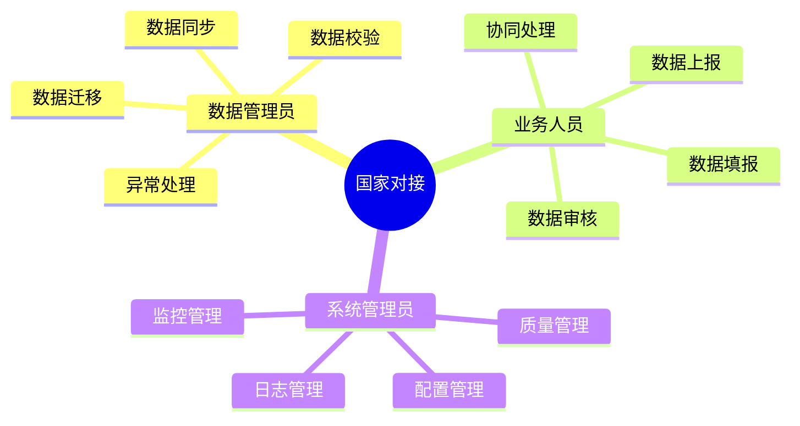
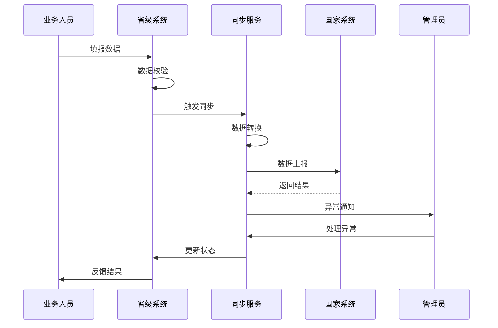

# 4. 国家系统对接

## 功能需求分析

### 原始需求

```yaml
功能需求：
1. 数据同步功能
   - 草地贪夜蛾防治数据
   - 绿色防控数据
   - 一般病虫害数据
   - 重大病虫害数据
   - 数据同步配置
2. 业务协同功能
   - 数据填报协同
   - 数据审核协同
   - 数据上报协同
   - 业务流程协同
3. 数据迁移功能
   - 历史数据迁移
   - 数据格式转换
   - 数据校验纠错
   - 迁移进度管理
4. 监控管理功能
   - 同步状态监控
   - 异常情况处理
   - 同步日志管理
   - 数据质量监控
```

### 用户角色分析



## 用户故事

### 数据管理员故事

1. 数据同步（Must Have）
```
作为一名数据管理员
我想要实现与国家系统的数据自动同步
以便于确保省级和国家系统数据的一致性
```

2. 数据迁移（Must Have）
```
作为一名数据管理员
我想要完成历史数据的规范化迁移
以便于保持数据的完整性和可用性
```

3. 数据校验（Must Have）
```
作为一名数据管理员
我想要对同步和迁移的数据进行校验
以便于确保数据的准确性和规范性
```

4. 异常处理（Must Have）
```
作为一名数据管理员
我想要及时处理同步和迁移过程中的异常
以便于保证数据传输的可靠性
```

### 业务人员故事

1. 数据填报（Must Have）
```
作为一名业务人员
我想要实现一次填报多处使用
以便于提高工作效率和数据准确性
```

2. 数据审核（Must Have）
```
作为一名业务人员
我想要对上报数据进行审核把关
以便于确保数据符合国家系统要求
```

3. 协同处理（Should Have）
```
作为一名业务人员
我想要与其他部门协同处理数据
以便于提高数据处理的效率
```

### 系统管理员故事

1. 监控管理（Must Have）
```
作为一名系统管理员
我想要实时监控数据同步状态
以便于及时发现和处理异常情况
```

2. 配置管理（Must Have）
```
作为一名系统管理员
我想要灵活配置同步策略和规则
以便于适应不同业务场景的需求
```

3. 质量管理（Must Have）
```
作为一名系统管理员
我想要监控和管理数据质量
以便于确保数据交换的有效性
```

## 场景描述

### 数据同步场景



### 场景详细描述

#### 1. 数据同步场景

**目标用户**：数据管理员

**前置条件**：
- 同步服务已配置
- 网络连接正常
- 具有同步权限

**操作流程**：
1. 配置同步规则
2. 启动同步任务
3. 监控同步过程
4. 处理同步异常
5. 验证同步结果

**预期结果**：
- 数据同步成功
- 数据格式正确
- 业务规则符合

**异常处理**：
- 网络异常重试
- 数据异常回滚
- 规则冲突解决

## 验收标准

### 功能验收标准

1. 数据同步功能
   - 支持实时同步
   - 支持定时同步
   - 支持手动同步
   - 支持批量同步

2. 业务协同功能
   - 支持一次填报
   - 支持多级审核
   - 支持状态跟踪
   - 支持流程协同

3. 监控管理功能
   - 支持状态监控
   - 支持异常处理
   - 支持日志查询
   - 支持质量监控

### 非功能验收标准

1. 性能要求
   - 同步延迟 < 1分钟
   - 批量处理 > 1000条/分钟
   - 系统响应 < 2秒
   - 并发同步 > 10个任务

2. 可靠性要求
   - 同步成功率 > 99.9%
   - 数据准确率 = 100%
   - 服务可用性 > 99.9%
   - 异常处理率 = 100%

3. 安全要求
   - 传输加密
   - 访问认证
   - 操作审计
   - 数据备份 