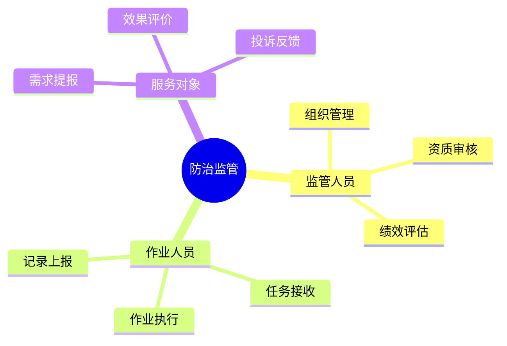
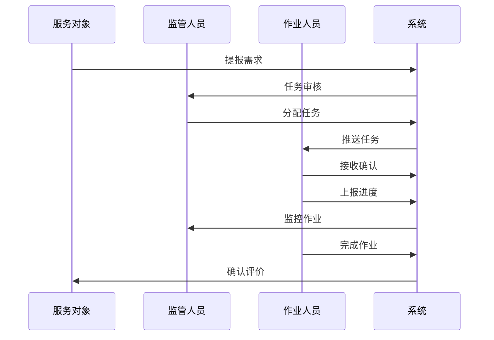

# 5. 防治监管

## 功能需求分析

### 原始需求

```yaml
功能需求：
1. 组织管理功能
   - 飞防服务组织管理
   - 无人机手信息管理
   - 作业资质管理
   - 信用评价管理
2. 设备管理功能
   - 无人机设备管理
   - 设备状态监控
   - 设备维护记录
   - 设备轨迹追踪
3. 作业管理功能
   - 作业任务分配
   - 作业过程监控
   - 作业效果评估
   - 作业记录管理
4. 监管评估功能
   - 防控效果评估
   - 作业质量评估
   - 服务满意度评估
   - 综合绩效评估
```

### 用户角色分析



## 用户故事

### 监管人员故事

1. 组织管理（Must Have）
```
作为一名监管人员
我想要管理飞防服务组织和无人机手信息
以便于规范防治服务市场秩序
```

2. 绩效评估（Must Have）
```
作为一名监管人员
我想要评估防控效果和作业质量
以便于提升防治工作水平
```

### 作业人员故事

1. 任务执行（Must Have）
```
作为一名作业人员
我想要及时接收和执行防治任务
以便于高效完成防治作业
```

2. 记录管理（Should Have）
```
作为一名作业人员
我想要规范记录作业过程和结果
以便于接受监督和评估
```

### 服务对象故事

1. 需求提报（Must Have）
```
作为一名服务对象
我想要方便地提报防治需求
以便于及时获得防治服务
```

2. 效果评价（Should Have）
```
作为一名服务对象
我想要对防治效果进行评价
以便于促进服务质量提升
```

## 场景描述

### 防治作业场景



### 场景详细描述

#### 1. 防治作业场景

**目标用户**：作业人员

**前置条件**：
- 已完成资质认证
- 设备状态正常
- 具有作业权限

**操作流程**：
1. 接收作业任务
2. 准备作业设备
3. 执行防治作业
4. 记录作业情况
5. 提交作业报告

**预期结果**：
- 完成防治作业
- 生成作业记录
- 获得效果评价

**异常处理**：
- 天气影响延期
- 设备故障备用
- 效果不佳返工

## 验收标准

### 功能验收标准

1. 组织管理功能
   - 支持资质管理
   - 支持信用评价
   - 支持黑名单管理

2. 作业管理功能
   - 支持任务分配
   - 支持过程监控
   - 支持效果评估

3. 监管评估功能
   - 支持实时监管
   - 支持数据统计
   - 支持绩效考核

### 非功能验收标准

1. 性能要求
   - 定位精度 < 5米
   - 轨迹延迟 < 10秒
   - 视频延迟 < 3秒

2. 可靠性要求
   - 轨迹记录完整性 > 99%
   - 作业记录准确性 > 99%
   - 系统可用性 > 99.9%

3. 安全要求
   - 实名认证
   - 轨迹加密
   - 数据防篡改 