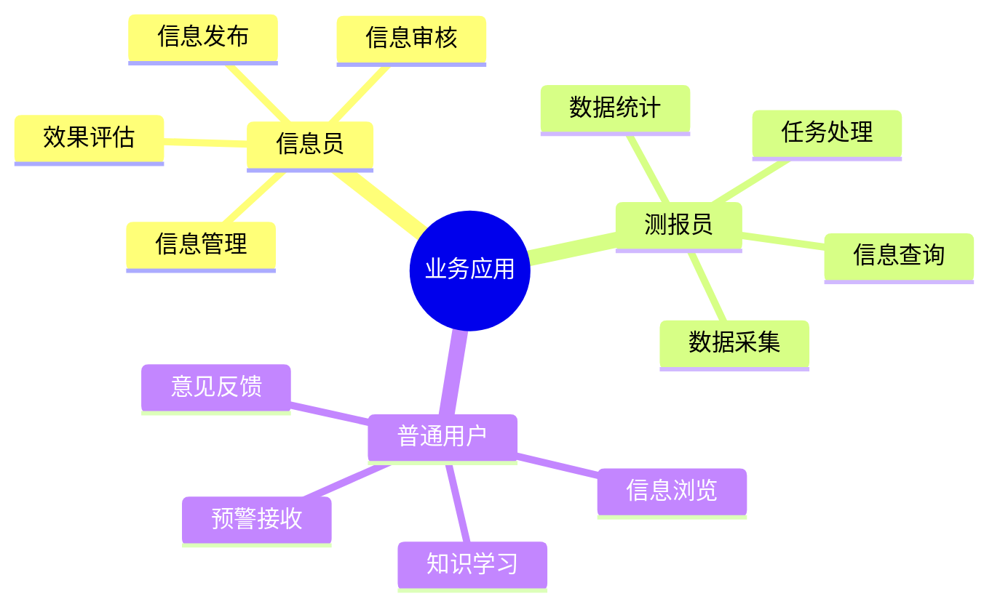
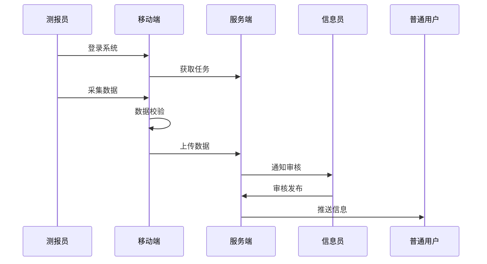

# 6. 业务应用

## 功能需求分析

### 原始需求

```yaml
功能需求：
1. 信息发布功能
   - 通知公告发布
   - 政策法规发布
   - 技术资料发布
   - 信息分类管理
   - 信息审核发布
2. 信息查询功能
   - 病虫害信息查询
   - 监测数据查询
   - 预警信息查询
   - 防治信息查询
   - 统计报表查询
3. 移动应用功能
   - 移动端数据采集
   - 移动端信息查看
   - 移动端预警接收
   - 移动端任务处理
   - 移动端数据统计
4. 会商会议功能
   - 会议组织管理
   - 会议资料管理
   - 会议记录管理
   - 会议决议管理
   - 会议效果评估
```

### 用户角色分析



## 用户故事

### 信息员故事

1. 信息发布（Must Have）
```
作为一名信息员
我想要发布各类植保信息
以便于及时传递重要信息给相关人员
```

2. 信息管理（Must Have）
```
作为一名信息员
我想要对发布的信息进行分类管理
以便于用户能够方便地查找所需信息
```

3. 信息审核（Must Have）
```
作为一名信息员
我想要对待发布信息进行审核
以便于确保信息的准确性和规范性
```

4. 效果评估（Should Have）
```
作为一名信息员
我想要评估信息发布效果
以便于改进信息发布策略
```

### 测报员故事

1. 数据采集（Must Have）
```
作为一名测报员
我想要通过移动端采集现场数据
以便于及时记录病虫害发生情况
```

2. 任务处理（Must Have）
```
作为一名测报员
我想要及时处理下发的工作任务
以便于完成测报工作要求
```

3. 数据统计（Must Have）
```
作为一名测报员
我想要统计分析采集的数据
以便于掌握病虫害发生趋势
```

4. 信息查询（Should Have）
```
作为一名测报员
我想要查询相关的技术资料
以便于指导测报工作开展
```

### 普通用户故事

1. 信息浏览（Must Have）
```
作为一名普通用户
我想要浏览各类植保信息
以便于了解病虫害防控动态
```

2. 预警接收（Must Have）
```
作为一名普通用户
我想要及时接收预警信息
以便于采取相应的防控措施
```

3. 知识学习（Should Have）
```
作为一名普通用户
我想要学习植保技术知识
以便于提高防控工作能力
```

4. 意见反馈（Should Have）
```
作为一名普通用户
我想要反馈使用过程中的问题
以便于帮助改进系统功能
```

## 场景描述

### 移动采集场景



### 场景详细描述

#### 1. 移动采集场景

**目标用户**：测报员

**前置条件**：
- 移动设备正常
- 网络连接可用
- 具有采集权限
- 任务已分配

**操作流程**：
1. 接收采集任务
2. 现场数据采集
3. 填写采集表单
4. 提交采集数据
5. 查看统计结果

**预期结果**：
- 数据采集完整
- 上传成功
- 统计结果准确

**异常处理**：
- 离线数据缓存
- 网络恢复重传
- 采集异常报告

## 验收标准

### 功能验收标准

1. 信息发布功能
   - 支持多类型发布
   - 支持分类管理
   - 支持审核流程
   - 支持效果统计

2. 移动应用功能
   - 支持离线采集
   - 支持实时上传
   - 支持数据校验
   - 支持任务管理

3. 会商会议功能
   - 支持会议管理
   - 支持资料管理
   - 支持记录管理
   - 支持决议跟踪

### 非功能验收标准

1. 性能要求
   - 页面加载时间 < 3秒
   - 数据提交响应 < 2秒
   - 离线数据容量 > 1000条
   - 并发用户数 > 1000

2. 可用性要求
   - 系统可用性 > 99.9%
   - 移动端适配率 = 100%
   - 操作步骤 < 3步
   - 故障恢复时间 < 10分钟

3. 易用性要求
   - 界面简洁直观
   - 操作流程简单
   - 提示信息清晰
   - 帮助文档完善 