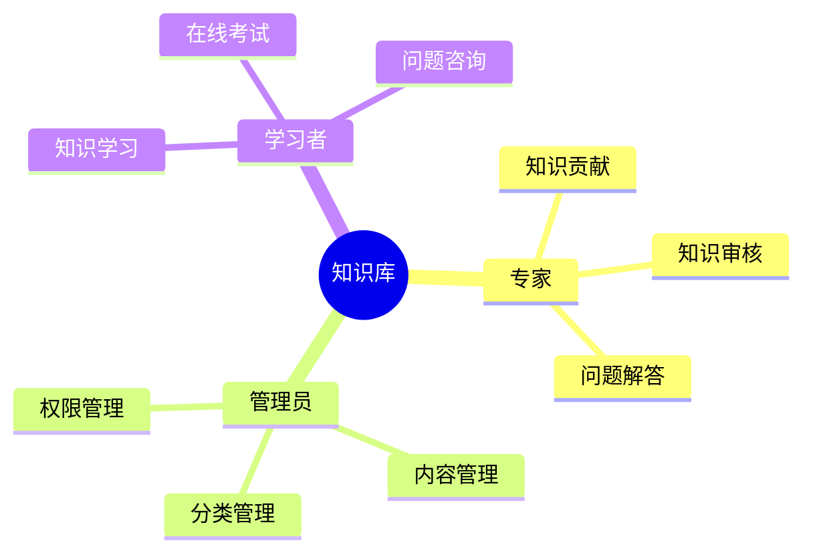
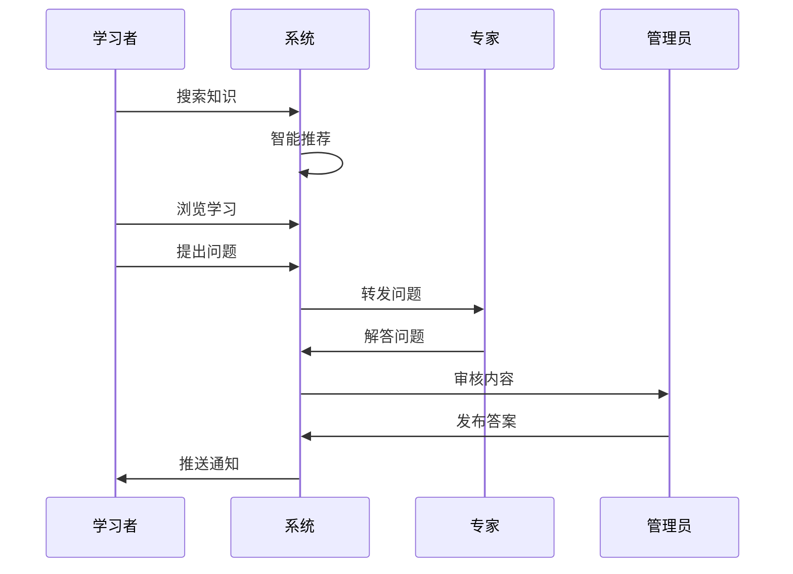

# 7. 病虫害知识库

## 功能需求分析

### 原始需求

```yaml
功能需求：
1. 知识采集功能
   - 病虫害识别知识
   - 防治技术知识
   - 专家经验知识
   - 多媒体资料采集
2. 知识管理功能
   - 知识分类管理
   - 知识审核管理
   - 知识更新管理
   - 知识标签管理
3. 知识应用功能
   - 知识检索查询
   - 知识推荐应用
   - 在线学习应用
   - 知识问答应用
4. 试题库功能
   - 试题采集管理
   - 试题分类管理
   - 试题组卷应用
   - 在线考试应用
```

### 用户角色分析



## 用户故事

### 专家故事

1. 知识贡献（Must Have）
```
作为一名植保专家
我想要贡献专业知识和经验
以便于帮助更多人了解病虫害防治
```

2. 问题解答（Should Have）
```
作为一名植保专家
我想要解答用户提出的问题
以便于提供专业的技术指导
```

### 管理员故事

1. 内容管理（Must Have）
```
作为一名知识库管理员
我想要管理和维护知识内容
以便于保证知识的质量和时效性
```

2. 分类管理（Must Have）
```
作为一名知识库管理员
我想要对知识进行分类和标签管理
以便于用户更容易找到所需信息
```

### 学习者故事

1. 知识学习（Must Have）
```
作为一名学习者
我想要方便地查找和学习相关知识
以便于提升病虫害防治技能
```

2. 在线考试（Should Have）
```
作为一名学习者
我想要参加在线考试和评估
以便于检验学习成果
```

## 场景描述

### 知识学习场景



### 场景详细描述

#### 1. 知识学习场景

**目标用户**：学习者

**前置条件**：
- 已注册账号
- 具有学习权限
- 系统运行正常

**操作流程**：
1. 搜索相关知识
2. 查看知识详情
3. 学习知识内容
4. 提出相关问题
5. 获取专家解答

**预期结果**：
- 找到所需知识
- 理解知识内容
- 问题得到解答

**异常处理**：
- 搜索无结果推荐
- 内容错误反馈
- 问题超时提醒

## 验收标准

### 功能验收标准

1. 知识管理功能
   - 支持多格式知识
   - 支持知识分类
   - 支持知识更新

2. 学习应用功能
   - 支持智能搜索
   - 支持在线学习
   - 支持知识问答

3. 考试评估功能
   - 支持试题管理
   - 支持在线考试
   - 支持成绩分析

### 非功能验收标准

1. 性能要求
   - 搜索响应 < 1秒
   - 图文加载 < 3秒
   - 视频加载 < 5秒

2. 易用性要求
   - 界面简洁清晰
   - 操作步骤简单
   - 提供使用帮助

3. 扩展性要求
   - 支持知识扩充
   - 支持格式扩展
   - 支持功能扩展 