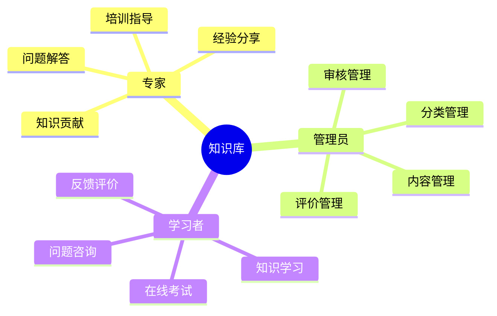
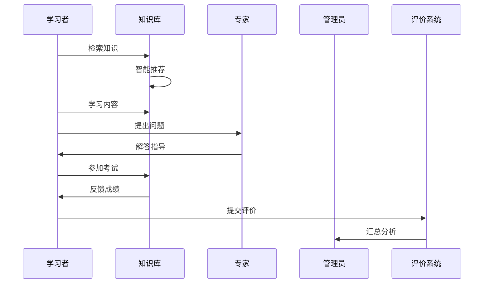

# 7. 病虫害知识库

## 功能需求分析

### 原始需求

```yaml
功能需求：
1. 知识采集功能
   - 专家知识采集
   - 文献资料采集
   - 多媒体资料采集
   - 防控经验采集
   - 采集成果评价
2. 知识管理功能
   - 知识分类管理
   - 知识标签管理
   - 知识审核管理
   - 知识更新管理
   - 知识评价管理
3. 知识应用功能
   - 知识检索应用
   - 知识推荐应用
   - 专家问答应用
   - 在线考试应用
   - 知识竞赛应用
4. 知识服务功能
   - 专家咨询服务
   - 技术培训服务
   - 经验分享服务
   - 在线答疑服务
   - 服务评价管理
```

### 用户角色分析



## 用户故事

### 专家故事

1. 知识贡献（Must Have）
```
作为一名植保专家
我想要贡献专业的病虫害防控知识
以便于帮助基层人员提高防控能力
```

2. 问题解答（Must Have）
```
作为一名植保专家
我想要解答用户提出的专业问题
以便于解决实际工作中遇到的困难
```

3. 培训指导（Must Have）
```
作为一名植保专家
我想要开展线上培训和指导
以便于提高基层人员的专业水平
```

4. 经验分享（Should Have）
```
作为一名植保专家
我想要分享实践中的成功经验
以便于推广先进的防控技术
```

### 管理员故事

1. 内容管理（Must Have）
```
作为一名知识库管理员
我想要对知识内容进行规范化管理
以便于用户能够方便地获取所需知识
```

2. 分类管理（Must Have）
```
作为一名知识库管理员
我想要建立科学的知识分类体系
以便于更好地组织和展示知识内容
```

3. 审核管理（Must Have）
```
作为一名知识库管理员
我想要对知识内容进行审核把关
以便于确保知识的准确性和规范性
```

4. 评价管理（Should Have）
```
作为一名知识库管理员
我想要管理用户的评价反馈
以便于持续改进知识库质量
```

### 学习者故事

1. 知识学习（Must Have）
```
作为一名学习者
我想要系统地学习病虫害防控知识
以便于提高自己的专业技能
```

2. 在线考试（Must Have）
```
作为一名学习者
我想要参加在线考试和知识竞赛
以便于检验自己的学习成果
```

3. 问题咨询（Must Have）
```
作为一名学习者
我想要在线咨询专家解决问题
以便于解决工作中遇到的困惑
```

4. 反馈评价（Should Have）
```
作为一名学习者
我想要对学习内容进行评价反馈
以便于帮助改进知识库内容
```

## 场景描述

### 知识学习场景



### 场景详细描述

#### 1. 知识学习场景

**目标用户**：学习者

**前置条件**：
- 用户已注册
- 知识内容完备
- 专家在线支持
- 考试题库准备

**操作流程**：
1. 检索学习内容
2. 系统学习知识
3. 在线提问交流
4. 参加知识考试
5. 提交学习评价

**预期结果**：
- 知识掌握牢固
- 问题得到解答
- 考试成绩合格

**异常处理**：
- 内容缺失补充
- 专家离线等待
- 考试异常重考

## 验收标准

### 功能验收标准

1. 知识管理功能
   - 支持多源采集
   - 支持分类管理
   - 支持审核流程
   - 支持评价反馈

2. 学习应用功能
   - 支持智能检索
   - 支持在线学习
   - 支持在线考试
   - 支持专家答疑

3. 服务评价功能
   - 支持服务评价
   - 支持意见反馈
   - 支持统计分析
   - 支持改进建议

### 非功能验收标准

1. 性能要求
   - 检索响应时间 < 2秒
   - 在线答疑响应 < 10分钟
   - 并发学习用户 > 500
   - 知识容量 > 10000条

2. 可用性要求
   - 系统可用性 > 99.9%
   - 知识更新周期 < 7天
   - 专家在线率 > 95%
   - 考试系统稳定性 = 100%

3. 易用性要求
   - 知识分类清晰
   - 检索功能便捷
   - 学习界面友好
   - 操作流程简单 