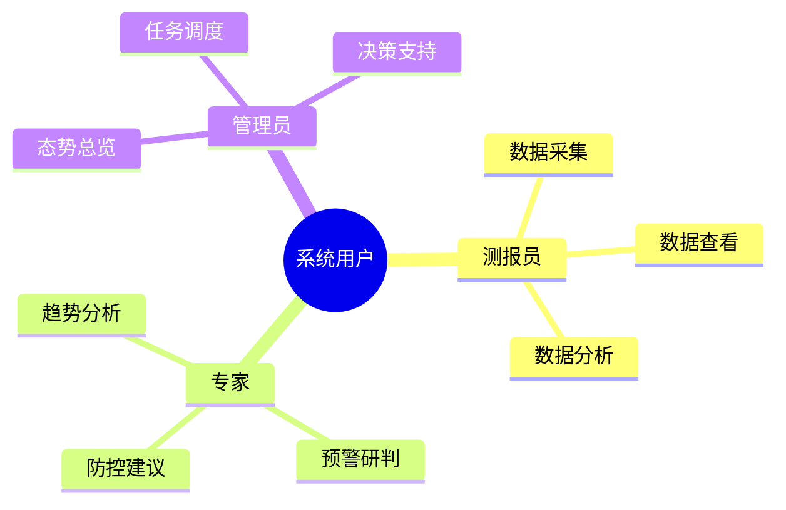
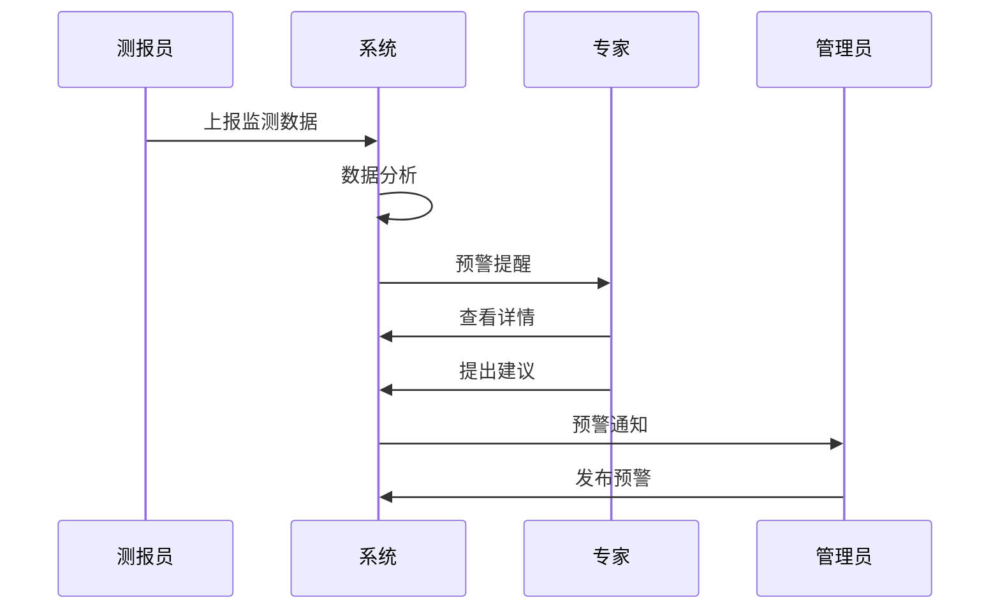

# 8. 指挥调度一张图

## 功能需求分析

### 原始需求

```yaml
功能需求：
1. 全省病虫害发生防治一张图
   - 展示全省病虫害发生面积统计
   - 展示全省病虫害防治面积统计
   - 展示病虫害发生趋势分析
2. 小麦赤霉病发生防治一张图
   - 展示病穗率分析
   - 展示同期对比分析
   - 展示区域分布情况
3. 草地贪夜蛾发生防治一张图
   - 展示发生县数统计
   - 展示面积变化趋势
   - 展示首见县分布情况
```

### 用户角色分析



## 用户故事

### 测报员故事

1. 数据录入（Must Have）
```
作为一名测报员
我想要便捷地录入病虫害监测数据
以便于及时反映田间病虫害发生情况
```

2. 数据查看（Must Have）
```
作为一名测报员
我想要查看本区域的历史监测数据
以便于进行同期对比分析
```

### 专家故事

1. 趋势分析（Must Have）
```
作为一名植保专家
我想要查看全省病虫害发生趋势图
以便于进行预警研判
```

2. 分布分析（Should Have）
```
作为一名植保专家
我想要查看病虫害的空间分布热力图
以便于掌握发生规律和特点
```

### 管理员故事

1. 态势总览（Must Have）
```
作为一名植保管理员
我想要查看全省病虫害发生和防治总体情况
以便于及时组织防控工作
```

2. 专题分析（Should Have）
```
作为一名植保管理员
我想要查看重点病虫害的专题分析报告
以便于进行针对性部署
```

## 场景描述

### 监测数据录入场景



### 场景详细描述

#### 1. 数据录入场景

**目标用户**：测报员

**前置条件**：
- 用户已登录系统
- 用户具有数据录入权限
- 已完成田间调查

**操作流程**：
1. 进入数据录入界面
2. 选择监测地点和时间
3. 填写病虫害发生信息
4. 上传现场照片（可选）
5. 提交数据

**预期结果**：
- 数据保存成功
- 生成监测记录
- 触发数据分析更新

**异常处理**：
- 网络异常时自动保存草稿
- 数据异常时提示校验规则
- 必填项缺失时阻止提交

## 验收标准

### 功能验收标准

1. 数据录入功能
   - 支持批量数据导入
   - 支持离线数据采集
   - 支持数据自动校验

2. 数据展示功能
   - 支持多维度数据查询
   - 支持图表可视化展示
   - 支持数据导出下载

3. 分析预警功能
   - 支持趋势分析预警
   - 支持阈值预警
   - 支持专家会商

### 非功能验收标准

1. 性能要求
   - 页面加载时间 < 3秒
   - 数据处理响应 < 1秒
   - 支持100个并发用户

2. 可用性要求
   - 系统可用性 > 99.9%
   - 支持7x24小时运行
   - 具备数据备份恢复

3. 安全要求
   - 支持角色权限控制
   - 数据传输加密
   - 操作日志记录 