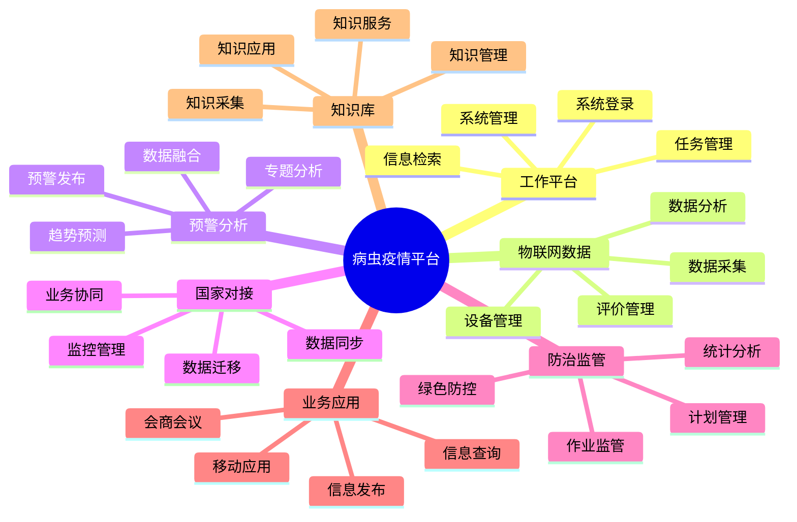
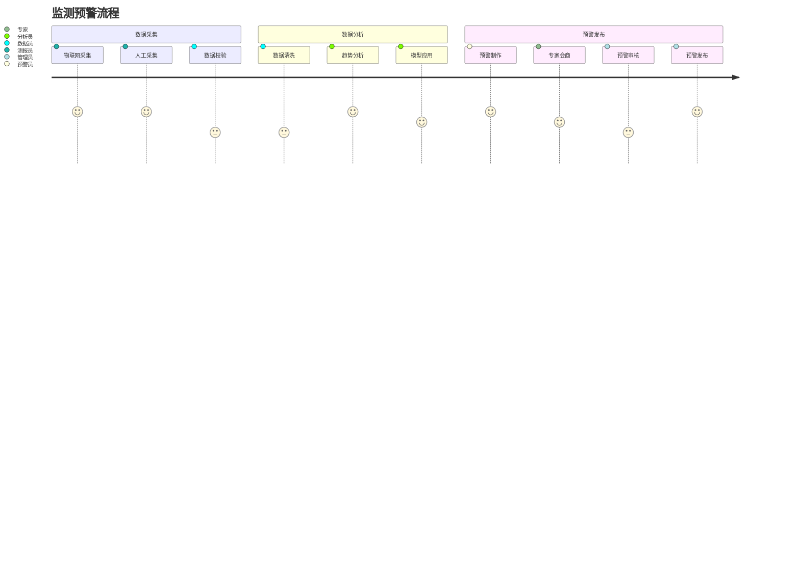
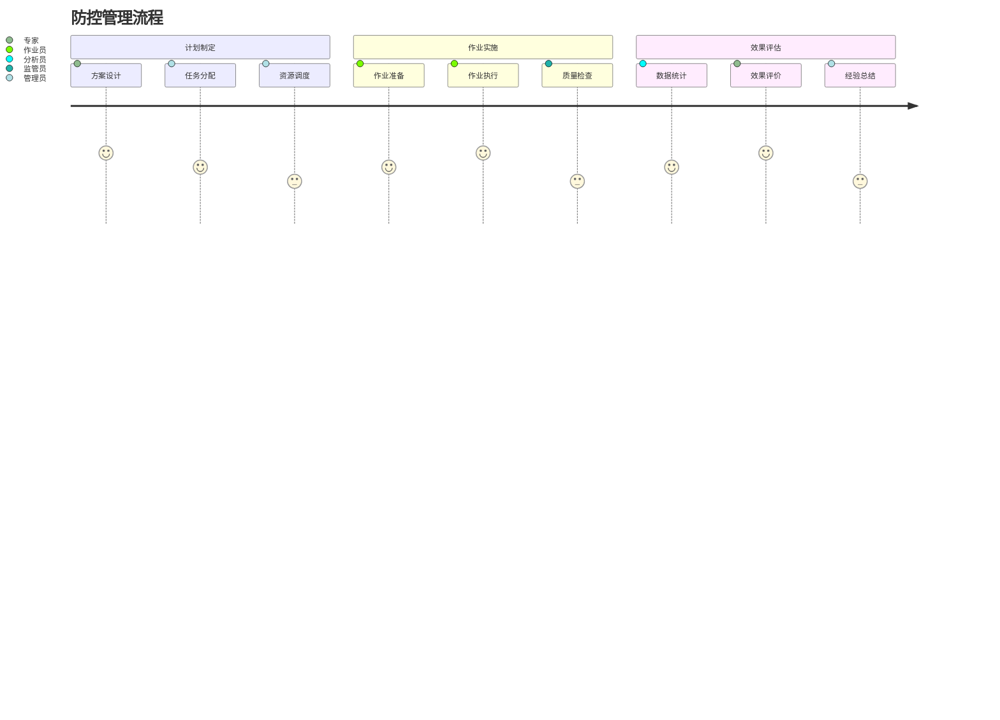

# 用户故事地图

## 总体架构

## 核心用户活动

### 1. 监测预警活动

### 2. 防控管理活动

## 优先级划分

### 第一优先级（Must Have）

1. 数据采集与监测
   - 物联网数据采集
   - 人工测报采集
   - 数据质量控制
   - 实时监测预警

2. 预警分析与发布
   - 多源数据融合
   - 趋势预测分析
   - 专家会商研判
   - 预警信息发布

3. 防治管理与监管
   - 防治计划制定
   - 作业过程监管
   - 效果评估分析
   - 统计报表生成

### 第二优先级（Should Have）

1. 知识管理与服务
   - 知识内容管理
   - 专家在线答疑
   - 技术培训服务
   - 经验交流分享

2. 系统对接与协同
   - 国家系统对接
   - 数据共享交换
   - 业务协同处理
   - 数据质量监控

3. 移动应用与服务
   - 移动端采集
   - 移动端查询
   - 移动端预警
   - 移动端管理

### 第三优先级（Could Have）

1. 辅助功能完善
   - 个性化配置
   - 统计分析
   - 系统监控
   - 运维管理

2. 系统优化提升
   - 性能优化
   - 界面优化
   - 流程优化
   - 体验改进

## 迭代计划

### 第一迭代（2个月）

重点完成：
- 物联网数据采集与管理
- 基础预警分析功能
- 核心防治监管功能
- 国家系统基础对接

### 第二迭代（2个月）

重点完成：
- 预警分析深化功能
- 专题分析功能完善
- 移动应用基础功能
- 知识库基础功能

### 第三迭代（2个月）

重点完成：
- 业务协同功能完善
- 知识服务功能深化
- 移动应用功能完善
- 系统优化与完善

## 验收标准

### 功能验收

1. 数据采集验收
   - 采集功能完整性
   - 数据质量达标率
   - 采集效率指标
   - 异常处理能力

2. 预警分析验收
   - 分析功能完整性
   - 预测准确率
   - 预警及时性
   - 会商功能可用性

3. 防控管理验收
   - 监管功能完整性
   - 作业监控覆盖率
   - 统计分析准确性
   - 评估功能可用性

### 非功能验收

1. 性能指标
   - 系统响应时间
   - 并发处理能力
   - 数据处理效率
   - 系统吞吐量

2. 可用性指标
   - 系统可用性
   - 数据可靠性
   - 功能可用性
   - 服务持续性

3. 安全性指标
   - 访问控制
   - 数据加密
   - 操作审计
   - 应急恢复 