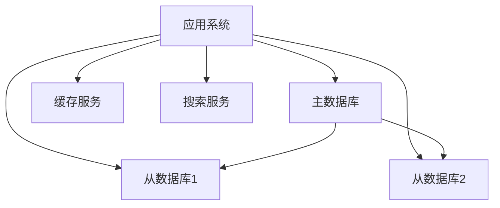
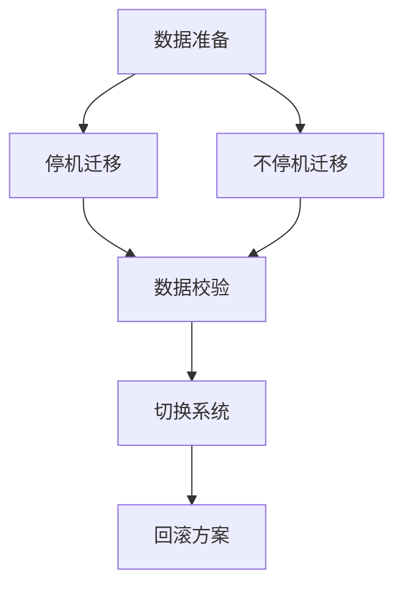

# 数据库设计规范

## 1. 数据库架构

### 1.1 整体架构


### 1.2 数据库选型
| 数据库类型 | 用途 | 版本 | 说明 |
|-----------|------|------|------|
| MySQL | 关系型数据库 | 8.0+ | 主要业务数据 |
| Redis | 缓存数据库 | 6.0+ | 缓存、会话管理 |
| MongoDB | 文档数据库 | 5.0+ | 文档存储 |
| Elasticsearch | 搜索引擎 | 7.0+ | 全文检索 |

## 2. 表结构设计

### 2.1 用户管理
```sql
-- 用户表
CREATE TABLE `sys_user` (
  `id` varchar(32) NOT NULL COMMENT '主键ID',
  `username` varchar(50) NOT NULL COMMENT '用户名',
  `password` varchar(100) NOT NULL COMMENT '密码',
  `real_name` varchar(50) COMMENT '真实姓名',
  `email` varchar(100) COMMENT '邮箱',
  `mobile` varchar(20) COMMENT '手机号',
  `status` tinyint NOT NULL DEFAULT 1 COMMENT '状态：0-禁用，1-启用',
  `create_time` datetime NOT NULL COMMENT '创建时间',
  `update_time` datetime NOT NULL COMMENT '更新时间',
  PRIMARY KEY (`id`),
  UNIQUE KEY `uk_username` (`username`)
) ENGINE=InnoDB DEFAULT CHARSET=utf8mb4 COMMENT='用户表';

-- 角色表
CREATE TABLE `sys_role` (
  `id` varchar(32) NOT NULL COMMENT '主键ID',
  `role_name` varchar(50) NOT NULL COMMENT '角色名称',
  `role_code` varchar(50) NOT NULL COMMENT '角色编码',
  `description` varchar(200) COMMENT '描述',
  `status` tinyint NOT NULL DEFAULT 1 COMMENT '状态：0-禁用，1-启用',
  `create_time` datetime NOT NULL COMMENT '创建时间',
  `update_time` datetime NOT NULL COMMENT '更新时间',
  PRIMARY KEY (`id`),
  UNIQUE KEY `uk_role_code` (`role_code`)
) ENGINE=InnoDB DEFAULT CHARSET=utf8mb4 COMMENT='角色表';
```

### 2.2 需求管理
```sql
-- 需求表
CREATE TABLE `req_requirement` (
  `id` varchar(32) NOT NULL COMMENT '主键ID',
  `title` varchar(200) NOT NULL COMMENT '需求标题',
  `description` text COMMENT '需求描述',
  `priority` varchar(20) NOT NULL COMMENT '优先级：high-高，medium-中，low-低',
  `status` varchar(20) NOT NULL COMMENT '状态：draft-草稿，submitted-已提交，processing-处理中，completed-已完成',
  `create_user_id` varchar(32) NOT NULL COMMENT '创建人ID',
  `assign_user_id` varchar(32) COMMENT '指派人ID',
  `create_time` datetime NOT NULL COMMENT '创建时间',
  `update_time` datetime NOT NULL COMMENT '更新时间',
  PRIMARY KEY (`id`),
  KEY `idx_create_user` (`create_user_id`),
  KEY `idx_assign_user` (`assign_user_id`)
) ENGINE=InnoDB DEFAULT CHARSET=utf8mb4 COMMENT='需求表';

-- 需求附件表
CREATE TABLE `req_attachment` (
  `id` varchar(32) NOT NULL COMMENT '主键ID',
  `requirement_id` varchar(32) NOT NULL COMMENT '需求ID',
  `file_name` varchar(200) NOT NULL COMMENT '文件名',
  `file_path` varchar(500) NOT NULL COMMENT '文件路径',
  `file_size` bigint NOT NULL COMMENT '文件大小',
  `file_type` varchar(50) NOT NULL COMMENT '文件类型',
  `create_user_id` varchar(32) NOT NULL COMMENT '上传人ID',
  `create_time` datetime NOT NULL COMMENT '创建时间',
  PRIMARY KEY (`id`),
  KEY `idx_requirement` (`requirement_id`)
) ENGINE=InnoDB DEFAULT CHARSET=utf8mb4 COMMENT='需求附件表';
```

### 2.3 文档管理
```sql
-- 文档表
CREATE TABLE `doc_document` (
  `id` varchar(32) NOT NULL COMMENT '主键ID',
  `title` varchar(200) NOT NULL COMMENT '文档标题',
  `content` longtext COMMENT '文档内容',
  `version` varchar(20) NOT NULL COMMENT '版本号',
  `status` varchar(20) NOT NULL COMMENT '状态：draft-草稿，reviewing-审核中，published-已发布',
  `category_id` varchar(32) COMMENT '分类ID',
  `create_user_id` varchar(32) NOT NULL COMMENT '创建人ID',
  `create_time` datetime NOT NULL COMMENT '创建时间',
  `update_time` datetime NOT NULL COMMENT '更新时间',
  PRIMARY KEY (`id`),
  KEY `idx_category` (`category_id`)
) ENGINE=InnoDB DEFAULT CHARSET=utf8mb4 COMMENT='文档表';

-- 文档审批表
CREATE TABLE `doc_approval` (
  `id` varchar(32) NOT NULL COMMENT '主键ID',
  `document_id` varchar(32) NOT NULL COMMENT '文档ID',
  `approver_id` varchar(32) NOT NULL COMMENT '审批人ID',
  `status` varchar(20) NOT NULL COMMENT '状态：pending-待审批，approved-已通过，rejected-已拒绝',
  `comment` varchar(500) COMMENT '审批意见',
  `create_time` datetime NOT NULL COMMENT '创建时间',
  `update_time` datetime NOT NULL COMMENT '更新时间',
  PRIMARY KEY (`id`),
  KEY `idx_document` (`document_id`)
) ENGINE=InnoDB DEFAULT CHARSET=utf8mb4 COMMENT='文档审批表';
```

## 3. 索引设计

### 3.1 索引规范
- 主键索引：使用UUID或雪花算法
- 唯一索引：业务唯一字段
- 普通索引：常用查询字段
- 联合索引：多字段组合查询
- 全文索引：文本搜索字段

### 3.2 索引示例
```sql
-- 用户表索引
ALTER TABLE `sys_user` ADD INDEX `idx_email` (`email`);
ALTER TABLE `sys_user` ADD INDEX `idx_mobile` (`mobile`);
ALTER TABLE `sys_user` ADD INDEX `idx_status_create_time` (`status`, `create_time`);

-- 需求表索引
ALTER TABLE `req_requirement` ADD INDEX `idx_status_priority` (`status`, `priority`);
ALTER TABLE `req_requirement` ADD INDEX `idx_create_time` (`create_time`);

-- 文档表索引
ALTER TABLE `doc_document` ADD FULLTEXT INDEX `idx_title_content` (`title`, `content`);
ALTER TABLE `doc_document` ADD INDEX `idx_status_create_time` (`status`, `create_time`);
```

## 4. 缓存设计

### 4.1 缓存策略
```json
{
  "cache": {
    "user": {
      "key": "user:{userId}",
      "expire": 1800,
      "type": "hash"
    },
    "requirement": {
      "key": "requirement:{reqId}",
      "expire": 3600,
      "type": "string"
    },
    "document": {
      "key": "document:{docId}",
      "expire": 3600,
      "type": "hash"
    }
  }
}
```

### 4.2 缓存结构
```redis
# 用户信息缓存
HSET user:123 id 123 username "zhangsan" realName "张三" email "zhangsan@example.com"

# 需求信息缓存
SET requirement:456 "{id:456,title:'需求标题',status:'processing'}"

# 文档信息缓存
HSET document:789 id 789 title "文档标题" version "1.0" status "published"
```

## 5. 数据迁移

### 5.1 迁移策略


### 5.2 迁移脚本
```sql
-- 数据迁移脚本示例
INSERT INTO new_sys_user (id, username, password, real_name, email, mobile, status, create_time, update_time)
SELECT id, username, password, real_name, email, mobile, status, create_time, update_time
FROM old_sys_user;

-- 数据校验脚本示例
SELECT COUNT(*) as new_count FROM new_sys_user;
SELECT COUNT(*) as old_count FROM old_sys_user;
```

## 6. 数据备份

### 6.1 备份策略
| 备份类型 | 周期 | 保留时间 | 存储位置 |
|---------|------|----------|----------|
| 全量备份 | 每周 | 3个月 | 本地+云存储 |
| 增量备份 | 每天 | 1个月 | 本地+云存储 |
| 归档备份 | 每月 | 1年 | 云存储 |

### 6.2 备份脚本
```bash
#!/bin/bash
# MySQL备份脚本
mysqldump -h localhost -u root -p password database > backup.sql

# Redis备份脚本
redis-cli SAVE

# MongoDB备份脚本
mongodump --host localhost --port 27017 --out /backup/mongodb
``` 