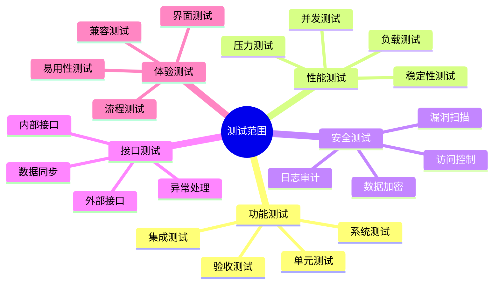

# 测试用例

## 测试概述

本测试用例集基于用户故事和场景设计，采用行为驱动开发（BDD）的方法，使用 Gherkin 语法描述测试场景。测试覆盖以下方面：

1. 功能测试：验证系统各个功能模块的正确性
2. 接口测试：验证系统内部和外部接口的正确性
3. 性能测试：验证系统在各种负载下的表现
4. 安全测试：验证系统的安全防护能力
5. 用户体验测试：验证系统的易用性和友好性

## 测试范围

## 测试环境

### 硬件环境
- 应用服务器：8核CPU，32G内存，500G存储
- 数据库服务器：16核CPU，64G内存，2T存储
- 文件服务器：8核CPU，32G内存，5T存储

### 软件环境
- 操作系统：CentOS 7.9
- 数据库：MySQL 8.0
- 应用服务器：Tomcat 9.0
- 开发框架：Spring Boot 2.7
- 浏览器：Chrome、Firefox、Edge最新版

### 网络环境
- 内网带宽：1000Mbps
- 外网带宽：100Mbps
- 网络延迟：<20ms

## 测试流程

## 测试方法

1. 黑盒测试
   - 等价类划分
   - 边界值分析
   - 场景测试
   - 错误推测

2. 白盒测试
   - 语句覆盖
   - 判定覆盖
   - 条件覆盖
   - 路径覆盖

3. 灰盒测试
   - 接口测试
   - 集成测试
   - 性能测试
   - 安全测试

## 测试工具

1. 功能测试
   - Selenium：Web自动化测试
   - JUnit：单元测试
   - Cucumber：BDD测试

2. 性能测试
   - JMeter：负载测试
   - Gatling：压力测试
   - Arthas：性能分析

3. 接口测试
   - Postman：接口调试
   - SoapUI：接口测试
   - Charles：接口监控

4. 安全测试
   - OWASP ZAP：安全扫描
   - Nessus：漏洞扫描
   - Burp Suite：渗透测试

## 测试度量

1. 测试覆盖率
   - 代码覆盖率 > 80%
   - 需求覆盖率 = 100%
   - 场景覆盖率 > 90%

2. 缺陷统计
   - 严重缺陷：0个
   - 主要缺陷：<5个
   - 次要缺陷：<20个

3. 性能指标
   - 响应时间：<2秒
   - 并发用户：>1000
   - CPU使用率：<70%
   - 内存使用率：<80%

## 测试用例组织

1. [工作平台测试用例](/docs/test-cases/1-work-platform.md)
2. [物联网数据管理测试用例](/docs/test-cases/2-iot-management.md)
3. [病虫预警分析测试用例](/docs/test-cases/3-pest-warning.md)
4. [国家系统对接测试用例](/docs/test-cases/4-national-system.md)
5. [防治监管测试用例](/docs/test-cases/5-prevention-control.md)
6. [业务应用测试用例](/docs/test-cases/6-business-application.md)
7. [病虫害知识库测试用例](/docs/test-cases/7-pest-knowledge.md)
8. [指挥调度一张图测试用例](/docs/test-cases/8-command-map.md) 